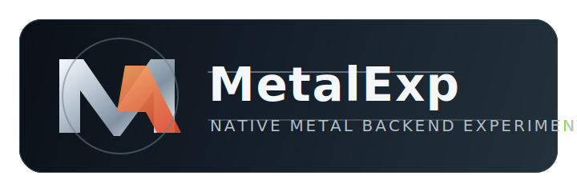

# MetalExp

<p align="center">
  
</p>

<p align="center">
  Experimental Fabric-delivered backend work for bringing a real native Metal renderer to modern Minecraft snapshots on macOS.
</p>

## What MetalExp Is

`MetalExp` is not a lightweight graphics tweak and it is not a Vulkan-to-Metal wrapper.
The project aims to introduce a real `MetalBackend` alongside Mojang's OpenGL and Vulkan backends, with project-owned settings, startup negotiation, diagnostics, and a native macOS bridge.

## Current Status

The repository currently covers the bootstrap side of the project:

- project-owned graphics API preference and config persistence
- startup backend planning with fallback and strict modes
- startup diagnostics logging
- video settings replacement with a `MetalExp` graphics API option
- startup backend negotiation override driven by `MetalExp` config
- a Java-side `MetalBackend` stub that is actually attempted during startup negotiation
- a native bridge probe boundary for library loading, process-level Metal capability checks, window-level Cocoa host probing, and first host-surface bootstrap/release scaffolding

What is still missing:

- a real `MetalBackend`
- native Cocoa and `CAMetalLayer` bring-up
- Metal device, surface, and resource lifecycle
- shader translation and pipeline compilation
- rendering viability in menus and world rendering

Today, selecting `METAL` still means scaffolding rather than a working renderer. The game now attempts a Java-side `MetalBackend` first, probes the native bridge for `CAMetalLayer`, `MTLDevice`, and `MTLCommandQueue` readiness, verifies that the active GLFW window unwraps to a Cocoa `NSWindow`/`NSView` host where a `CAMetalLayer` can be attached, and then bootstraps and releases a native host surface handle that already reports initial `drawableSize` and `contentsScale` before finally falling through to Vulkan/OpenGL in fallback mode or stopping after the Metal backend failure in strict mode.

## Target Environment

- Platform: macOS
- Minecraft target: `26.2-snapshot-1`
- Loader: Fabric Loader
- Java: 25

## Repository Layout

- `src/main` and `src/client`: Fabric entrypoints, mixins, config, diagnostics, and Minecraft-facing integration points
- `native/`: reserved for the macOS Cocoa and Metal bridge
- `shared/`: reserved for shared models, diagnostics payloads, and future backend-facing types
- `docs/`: design specs, milestone plans, and reverse-engineering notes

## Development Flow

`dev` is the primary development branch for this repository.
Unless explicitly requested otherwise, ongoing implementation and cleanup work should land on `dev`.

Canonical project references:

1. `docs/specs/2026-04-09-metalexp-design.md`
2. `docs/plans/2026-04-09-metalexp-bootstrap-plan.md`
3. `docs/research/2026-04-09-minecraft-26.2-vulkan-metal-research_cn.md`

## Near-Term Roadmap

1. Replace the current Metal scaffolding with a real `MetalBackend` entry path.
2. Bring up the native macOS bridge for window extraction, `CAMetalLayer`, device, queue, and drawable lifecycle.
3. Build surface/device/resource fundamentals.
4. Add the shader toolchain path from GLSL to SPIR-V to MSL.
5. Reach first rendering viability for startup, menu entry, resize, and shutdown.

## Building

```bash
./gradlew test
./gradlew build
```

On macOS, the Gradle build also compiles `build/native/libmetalexp_native.dylib` for the current JNI probe implementation.

## License

This project is licensed under the MIT License. See `LICENSE`.
